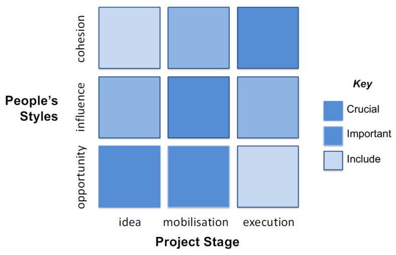

```{r setup, include=FALSE}
library(reshape2)
library(lsa)
library(ggplot2)
library(pander)
library(MASS)
library(AER)
library(gridExtra)
library(plyr)
library(igraph)
library(stargazer)
library(knitr)
library(xlsx)
```

```{r echo=FALSE}
# load data
picks.data <- read.csv("peoplepickinganonymised.csv")
```

## Question 1: Regressions  

The density plots of the in-degrees for the four networks are plotted below.  
  
```{r echo=FALSE, warning = FALSE, fig.height = 8, fig.width = 15}
# cosine similarity

# first create an empty matrix that will be populated with the cosine similarity results
mat.cosine <- matrix(0, 60, 5)
mat.jaccard <- matrix(0, 60, 5)

# subset data to only include the picks
sub.data <- picks.data[ , -1:-3]

friendInDegree <- colSums(sub.data[ , 1:60])
creativityInDegree <- colSums(sub.data[ , 121:180])
influenceInDegree <- colSums(sub.data[ , 181:240])
implementationInDegree <- colSums(sub.data[ , 241:300])

densityFriends <- 
    ggplot() + geom_density(aes(x = friendInDegree)) +
    scale_x_continuous(breaks = seq(0, 25, 5)) +
    scale_y_continuous(breaks = seq(0, 0.25, 0.05)) +
    labs(x = "In-Degree", y = "Density", title = "Density Plot of Friendship Network In-Degree") +
    theme_bw()

densityCreative <- 
    ggplot() + geom_density(aes(x = creativityInDegree)) +
    scale_x_continuous(breaks = seq(0, 25, 5)) +
    scale_y_continuous(breaks = seq(0, 0.25, 0.05)) +
    labs(x = "In-Degree", y = "Density", title = "Density Plot of Creativity Network In-Degree") +
    theme_bw()

densityInfluence <- 
    ggplot() + geom_density(aes(x = influenceInDegree)) +
    scale_x_continuous(breaks = seq(0, 25, 5)) +
    scale_y_continuous(breaks = seq(0, 0.25, 0.05)) +
    labs(x = "In-Degree", y = "Density", title = "Density Plot of Influence Network In-Degree") +
    theme_bw()

densityImplementation <- 
    ggplot() + geom_density(aes(x = implementationInDegree)) +
    scale_x_continuous(breaks = seq(0, 25, 5)) +
    scale_y_continuous(breaks = seq(0, 0.25, 0.05)) +
    labs(x = "In-Degree", y = "Density", title = "Density Plot of Implementation Network In-Degree") +
    theme_bw()

grid.arrange(densityFriends, densityCreative, densityInfluence, densityImplementation, ncol = 2)

```
  
Since in-degree is a count data, we could use the discrete probability distribution (e.g. Poisson, Negative Binomial) for the regression model. An overdispersion test has been performed and there is evidence of overdispersion (i.e. mean is not equal to variance) in the data, especially for implementation network (P-Value < 0.01). Therefore, negative binomial regression will be a better fit.  

The below three tables shows the regression results of the three networks. As seen from the tables, the in-degree of friendship network is very statistically significant. Hence higher popularity is expected to increase the votes one receives in the other three networks.  

```{r echo=FALSE, results = "asis"}

fsCR.poi <- glm(creativityInDegree ~ friendInDegree, family = "poisson"(link = "log"))
fsCR.nb <- glm.nb(creativityInDegree ~ friendInDegree)

stargazer(list(fsCR.poi, fsCR.nb), type = "latex", style = "qje", digits = 3, 
          header = FALSE, no.space = TRUE, title = "Regression of Creativity Network In-Degree", 
          dep.var.labels = "Creativity Network In-Degree", font.size = "footnotesize")
#          column.labels = c("Poisson Model", "Negative Binomial Model"))

```

```{r echo=FALSE, results = "asis"}

fsIN.poi <- glm(influenceInDegree ~ friendInDegree, family = "poisson"(link = "log"))
fsIN.nb <- glm.nb(influenceInDegree ~ friendInDegree)

stargazer(list(fsIN.poi, fsIN.nb), type = "latex", style = "qje", digits = 3, 
          header = FALSE, no.space = TRUE, title = "Regression of Influence Network In-Degree", 
          dep.var.labels = "Influence Network In-Degree", font.size = "footnotesize") 
#          column.labels = c("Poisson Model", "Negative Binomial Model"))

```

```{r echo=FALSE, results = "asis"}

fsIM.poi <- glm(implementationInDegree ~ friendInDegree, family = "poisson"(link = "log"))
fsIM.nb <- glm.nb(implementationInDegree ~ friendInDegree)

stargazer(list(fsIM.poi, fsIM.nb), type = "latex", style = "qje", digits = 3, 
          header = FALSE, no.space = TRUE, title = "Regression of Implementation Network In-Degree", 
          dep.var.labels = "Implementation Network In-Degree", font.size = "footnotesize")

```

```{r echo=FALSE, warning = FALSE, fig.height = 8, fig.width = 15}
# Function to compute Jaccard Similarity
jaccard <- function(x, y) {
    dotproduct <- x %*% y
    dotproduct / (sum(x^2) + sum(y^2) - dotproduct)
}

diag(sub.data[ , 1:60]) <- 0
diag(sub.data[ , 61:120]) <- 0
diag(sub.data[ , 121:180]) <- 0
diag(sub.data[ , 181:240]) <- 0
diag(sub.data[ , 241:300]) <- 0

# calculate cosine similarity and populate matrix
for (id in 1:nrow(sub.data)) {
    
    # extract all the vectors needed to calculate the cosine similarities
    friend <- as.numeric(sub.data[id, 1:60])   # skip the influence picks
    creativity <- as.numeric(sub.data[id, 121:180])
    influence <- as.numeric(sub.data[id, 181:240])
    implementation <- as.numeric(sub.data[id, 241:300])
    
    # populate cosine matrix
    mat.cosine[id, 2] <- cosine(friend, friend)
    mat.cosine[id, 3] <- cosine(friend, creativity)
    mat.cosine[id, 4] <- cosine(friend, influence)
    mat.cosine[id, 5] <- cosine(friend, implementation)
    mat.jaccard[id, 2] <- jaccard(friend, friend)
    mat.jaccard[id, 3] <- jaccard(friend, creativity)
    mat.jaccard[id, 4] <- jaccard(friend, influence)
    mat.jaccard[id, 5] <- jaccard(friend, implementation)
    
}

# calculate the mean cosine similarity for each ID, without Friend_Friend column
meansCosine <- rowMeans(mat.cosine[ , 3:5])
meansJaccard <- rowMeans(mat.jaccard[ , 3:5])

# combine means to cosine matrix
mat.cosineM <- cbind(mat.cosine, meansCosine)
mat.jaccardM <- cbind(mat.jaccard, meansJaccard)

# convert to dataframe, add column names, populate ID column
data.cosine <- data.frame(mat.cosineM)
data.jaccard <- data.frame(mat.jaccardM)

namesPair <- c("id", "Friend_Friend", "Friend_Creativity", "Friend_Influence", "Friend_Implementation", "Average")
colnames(data.cosine) <- namesPair
colnames(data.jaccard) <- namesPair

data.cosine$id <- 1:60
data.jaccard$id <- 1:60

# order "average" decreasing
cosine.order <- data.cosine[order(-data.cosine$Average), ]
jaccard.order <- data.jaccard[order(-data.jaccard$Average), ]

# z-score function
z.score <- function(x, mean, sd) {
    (x - mean) / sd
}

# mean of cosine scores
mean.cosine <- mean(cosine.order$Average, na.rm = TRUE)
mean.jaccard <- mean(jaccard.order$Average, na.rm = TRUE)

# sd of cosine scores
sd.cosine <- sd(cosine.order$Average, na.rm = TRUE)
sd.jaccard <- sd(jaccard.order$Average, na.rm = TRUE)

# apply z-score function to calculate z-score
cosine.order$Z.score <- sapply(cosine.order$Average, z.score, mean = mean.cosine, sd = sd.cosine)
jaccard.order$Z.score <- sapply(jaccard.order$Average, z.score, mean = mean.jaccard, sd = sd.jaccard)
```

\pagebreak

## Question 2: Cosine Similarity  

Three different values were calculated for the similarities between Friendship-Creativity, Friendship-Influence, and Friendship-Implementation picks. The final score averages the three individual scores. The below graphs display the distribution of the average scores and the ranking of each individual based on the scores (lower similarity score indicates higher flexibility).  

```{r plot, echo=FALSE, warning = FALSE, fig.height = 8, fig.width = 15}

# plot histogram of average cosine similarities
histCos <- 
    ggplot(na.omit(cosine.order), aes(x = Average)) + 
    geom_histogram(colour = "black", fill = "lightblue", alpha = .75, breaks = seq(0, 1, by = .1)) +
    scale_y_continuous(breaks = seq(1, 20, 1), limits = c(0, 13)) +
    scale_x_continuous(breaks = seq(0, 1, .1)) +
    labs(x = "Cosine similarity", y = "Number of individuals", title = "Histogram of Cosine Similarity") +
    theme_bw()

barCos <-
    ggplot(na.omit(cosine.order), aes(y = Average, x = reorder(factor(id), Average))) +
    geom_bar(stat = "identity", width = .75, colour = "black", fill = "lightblue", alpha = .75) +
    scale_y_continuous(breaks = seq(0, 1, .1)) +
    labs(y = "Cosine similarity", x = "ID", title = "Ranking of Cosine Similarity") +
    coord_flip() +
    theme_bw()

grid.arrange(histCos, barCos, ncol = 2)

```

Below table shows the average similarity score and Z-score for each individual (ordered by similarity score).  

\footnotesize

```{r pander, echo=FALSE, warning = FALSE}

# subset cosine table to only include ID, average, z-score
cosine.table <- cosine.order[, c("id", "Average", "Z.score")]
panderOptions("digits", 3)
colnames(cosine.table) <- c("ID", "Average Score", "Z-score")
row.names(cosine.table) <- NULL
pander(cosine.table, caption = "Average Cosine Similarity Score Ranking")

# jaccard.table <- jaccard.order[, c("id", "Average", "Z.score")]
# panderOptions("digits", 3)
# colnames(jaccard.table) <- c("ID", "Average Score", "Z-score")
# row.names(jaccard.table) <- NULL
# pander(jaccard.table, caption = "Average Jaccard Similarity Score Ranking")

```

\pagebreak

## Question 3: Leaders  



With reference to the above framework, the leader for each task must have the party type listed in below table:  

```{r echo = FALSE}
leaderCriteria <- data.frame(tasks = c("Design", "Lobbying", "Implementation"), 
                             guest = c("Expansive", "Expansive, Exclusive", "Cohesive"), 
                             similarity = c("0.275", "0.275", "0.2"), 
                             friendship = c("0.05", "0.05", "0.1"),
                             advice = c("0.275", "0.275", "0.35"),
                             creativity = c("0.40", "0", "0"),
                             influence = c("0", "0.40", "0"), 
                             implementation = c("0", "0", "0.35"))

colnames(leaderCriteria) <- c("Tasks", "Guest List", "Flexibility", "Friends", "Advice", 
                              "Creative", "Influence", "Impl")

pander(leaderCriteria[ , 1:2], caption = "Guest List Criteria for Each Leder")

```

To select the best leader, the in-degree centrality scores from each category are weighted according their respective importance in each task. The detailed weightings are tabulated below.  

```{r echo = FALSE}
pander(leaderCriteria[ , -2], caption = "Weighting Each Score for Leader Selection")
```

```{r echo=FALSE}

fulldata <- picks.data

#cleaning up and wrangling data
fulldata[, c(1:303)] <- sapply(fulldata[, c(1:303)], as.numeric)

#make seperate df for each component, set diagonal to 0 and sum up columns
friends <- fulldata[,4:63] 
friends[row(friends) == col(friends) ] <- 0
friends["Total",] <- colSums(friends)

advice <- fulldata[,64:123]
advice[row(advice) == col(advice) ] <- 0
advice["Total",] <- colSums(advice)


creativity <- fulldata[,124:183]
creativity[row(creativity) == col(creativity) ] <- 0
creativity["Total",] <- colSums(creativity)

implementation <- fulldata[,184:243]
implementation[row(implementation) == col(implementation) ] <- 0
implementation["Total",] <- colSums(implementation)


influence <- fulldata[,244:303]
influence[row(influence) == col(influence) ] <- 0
influence["Total",] <- colSums(influence)

#transform dataframes and turn back into df
friendstr <- as.data.frame(t(friends))
advicetr <- as.data.frame(t(advice))
creativitytr <- as.data.frame(t(creativity))
implementationtr <- as.data.frame(t(implementation))
influencetr <- as.data.frame(t(influence))

#add rank to dataframes and sort
friendstr[,"rank"] <- rank(-friendstr[,"Total"], ties.method = "average")
friendstr1 <-friendstr[order(friendstr$rank, decreasing=FALSE), ]

advicetr[,"rank"] <- rank(-advicetr[,"Total"], ties.method = "average")
advicetr1 <-advicetr[order(advicetr$rank, decreasing=FALSE), ]

creativitytr[,"rank"] <- rank(-creativitytr[,"Total"], ties.method = "average")
creativitytr1 <-creativitytr[order(creativitytr$rank, decreasing=FALSE), ]

implementationtr[,"rank"] <- rank(-implementationtr[,"Total"], ties.method = "average")
implementationtr1 <- implementationtr[order(implementationtr$rank, decreasing=FALSE), ]

influencetr[,"rank"] <- rank(-influencetr[,"Total"], ties.method = "average")
influencetr1 <- influencetr[order(influencetr$rank, decreasing=FALSE), ]

#guestlist preference

#1 exclusive 2 expansive 3 tight
guestlist <- as.data.frame(fulldata[,"guestlist"])
guestlist[,"id"] <- c(1:60)

cosine.order[,"average.cs.rank"] <- rank(cosine.order[,"Average"], ties.method = "average")

#order via id
cosine.order <- cosine.order[order(cosine.order$id, decreasing=FALSE), ]

```

\pagebreak

### Lobbying Leader  

The following table lists the top 3 leader candidates for lobbying. We select person 33 to be the leader.  

```{r LobbyLeader, echo=FALSE}

# only accept expansive or exclusive
b <- c(1,2)
df4 <- guestlist[guestlist[,1] %in% b,]

#for the above people, pull advice and influence scores and ranks and create table

values <- df4$id #list of people

lob10 <- advicetr[values, 61:62]
lob10 <- rename(lob10[,1:2], c("Total"="advice_total", "rank"="advice_rank"))
lob10[,"advice.weighted.rank"] <- lob10$advice_rank * 0.30
lob20 <- influencetr[values,61:62]
lob20 <- rename(lob20[,1:2], c("Total"="influence_total", "rank"="influence_rank"))
lob20[,"influence.weight.rank"] <- lob20$influence_rank * 0.40
summarytable01 <- cbind(lob10, lob20)

#add cosine similiarity to table for influence and average
summarytable01 <- cbind(summarytable01, cosine.order[values, 8])
summarytable01 <- rename(summarytable01, c("cosine.order[values, 8]"="cs_avg_rank"))
summarytable01[,"cs_avg_rank.weighted"] <- summarytable01$cs_avg_rank * 0.25

#add friend to table
summarytable01 <-cbind(summarytable01, friendstr[values,61:62])
summarytable01 <-rename(summarytable01, c("Total"="friends_total", "rank"="friends_rank"))
summarytable01[,"friends_rank.weighted"] <- summarytable01$friends_rank * 0.05

#sum up all criteria and rank
summarytable01[, "total"] <- rowSums(summarytable01[,c(3,6,8,11)]) 
summarytable01[,"total.rank"] <-rank(summarytable01[,"total"], ties.method = "min")


#sort based on total.rank
summarytable01 <- summarytable01[order(summarytable01$total.rank, decreasing=FALSE), ]

summarytable01$ID <- rownames(summarytable01)

lobbyTop3 <- head(summarytable01[ , c("ID", "cs_avg_rank", "friends_rank", "advice_rank", "influence_rank", 
                                      "total.rank")], 3)

colnames(lobbyTop3) <- c("ID", "Flexibility", "Friends", "Advice", "Influence", "Final Rank")

lobbyTop3$ID <- unlist(sapply(lobbyTop3$ID, strsplit, split = "_"))[seq(2, 6, 2)]

rownames(lobbyTop3) <- NULL
#rownames(lobbyTop3) <- unlist(sapply(rownames(lobbyTop3), strsplit, split = "_"))[seq(2, 6, 2)]

pander(lobbyTop3, caption = "Top 3 Lobbying Leader Candidates")

```

### Design Leader  

The following table lists the top 3 leader candidates for design. Since person 33 has already been selected for lobbying, we select the next best candidate - person 30.  

```{r DesignLeader, echo=FALSE}

# only accept expansive
c <- 2
df5 <- guestlist[guestlist[,1] %in% c,]

#for the above people, pull advice and creativity scores and ranks and create table

values11 <- df5$id #list of people

creat11 <- advicetr[values11, 61:62]
creat11 <- rename(creat11[,1:2], c("Total"="advice_total", "rank"="advice_rank"))
creat11[,"advice.weighted.rank"] <- creat11$advice_rank * 0.30
creat21 <- creativitytr[values11,61:62]
creat21 <- rename(creat21[,1:2], c("Total"="creativity_total", "rank"="creativity_rank"))
creat21[,"influence.weighted.rank"] <- creat21$creativity_rank * 0.40
summarytable11 <- cbind(creat11, creat21)


#add cosine similiarity to table for influence and average
summarytable11 <- cbind(summarytable11,cosine.order[values11, 8])
summarytable11 <- rename(summarytable11, c("cosine.order[values11, 8]"="cs_avg_rank"))
summarytable11["cs_avg_rank.weighted"] <- summarytable11$cs_avg_rank * 0.25

#add friend to table
summarytable11 <-cbind(summarytable11, friendstr[values11,61:62])
summarytable11 <-rename(summarytable11, c("Total"="friends_total", "rank"="friends_rank"))
summarytable11[,"friends_rank.weighted"] <- summarytable11$friends_rank * 0.05


#sum up criteria
summarytable11[, "total"] <- rowSums(summarytable11[,c(3,6,8,11)])
summarytable11[,"total.rank"] <-rank(summarytable11[,"total"], ties.method = "min")

#sort based on total.rank
summarytable11 <- summarytable11[order(summarytable11$total.rank, decreasing=FALSE), ]

summarytable11$ID <- rownames(summarytable11)

designTop3 <- head(summarytable11[ , c("ID", "cs_avg_rank", "friends_rank", "advice_rank", "creativity_rank", 
                                       "total.rank")], 3)

colnames(designTop3) <- c("ID", "Flexibility", "Friends", "Advice", "Creative", "Final Rank")
designTop3$ID <- unlist(sapply(designTop3$ID, strsplit, split = "_"))[seq(2, 6, 2)]
rownames(designTop3) <- NULL

pander(designTop3, caption = "Top 3 Design Leader Candidates")

```

### Implementation Leader  

The following table lists the top 3 leader candidates for implementation and person 19 is chosen as the leader.  

```{r ImplLeader, echo=FALSE}

# only accept cohesive
a <- 3
df3 <- guestlist[guestlist[,1] %in% a,]

#for the above people, pull advice and implementation scores and ranks and create table

values21 <- df3$id #list of people

implem11 <- advicetr[values21, 61:62]
implem11 <- rename(implem11[,1:2], c("Total"="advice_total", "rank"="advice_rank"))
implem11[,"advice.weighted.rank"] <- implem11$advice_rank * 0.35
implem21 <- implementationtr[values21,61:62]
implem21 <- rename(implem21[,1:2], c("Total"="implementation_total", "rank"="implementation_rank"))
implem21[,"influence.weighted.rank"] <- implem21$implementation_rank * 0.35
summarytable21 <- cbind(implem11, implem21)


#add cosine similiarity to table for influence and average
summarytable21 <- cbind(summarytable21,cosine.order[values21, 8])
summarytable21 <- rename(summarytable21, c("cosine.order[values21, 8]"="cs_avg_rank"))
summarytable21["cs_avg_rank.weighted"] <- summarytable21$cs_avg_rank * 0.2

#add friend to table
summarytable21 <-cbind(summarytable21, friendstr[values21,61:62])
summarytable21 <-rename(summarytable21, c("Total"="friends_total", "rank"="friends_rank"))
summarytable21[,"friends_rank.weighted"] <- summarytable21$friends_rank * 0.1

#sum up criteria
summarytable21[, "total"] <- rowSums(summarytable21[,c(3,6,8,11)])
summarytable21[,"total.rank"] <-rank(summarytable21[,"total"], ties.method = "min")

#sort based on total.rank
summarytable21 <- summarytable21[order(summarytable21$total.rank, decreasing=FALSE), ]

summarytable21$ID <- rownames(summarytable21)

implTop3 <- head(summarytable21[ , c("ID", "cs_avg_rank", "friends_rank", "advice_rank", 
                                     "implementation_rank", "total.rank")], 3)

colnames(implTop3) <- c("ID", "Flexibility", "Friends", "Advice", "Implementation", "Final Rank")

implTop3$ID <- unlist(sapply(implTop3$ID, strsplit, split = "_"))[seq(2, 6, 2)]
rownames(implTop3) <- NULL

pander(implTop3, caption = "Top 3 Implementation Leader Candidates")

```

\pagebreak

## Question 4 - ID Rankings  

\footnotesize

```{r inDegreeCalc, echo = FALSE, fig.height = 8, fig.width = 15}

fulldata <- picks.data

dffrmatrix <- fulldata[,4:63]
frmatrix <- as.matrix(dffrmatrix)

G <- graph_from_adjacency_matrix(frmatrix, mode = "directed", add.colnames = TRUE, diag = FALSE)

G.degree <- degree(G, mode="in")
set.seed(888)
com <- cluster_infomap(G)
G <- set_graph_attr(G, "layout", layout.fruchterman.reingold(G))
nodes <- 1:60
cluster1 <- nodes[com$membership == 1]
cluster2 <- nodes[com$membership == 2]
cluster3 <- nodes[com$membership == 3]
cluster4 <- nodes[com$membership == 4]
V(G)[cluster1]$color <- "#2DA5DB"
V(G)[cluster2]$color <- "#37BDA7"
V(G)[cluster3]$color <- "#E50328"
V(G)[cluster4]$color <- "orchid4"

dfcrmatrix <- fulldata[,124:183]
crmatrix <- as.matrix(dfcrmatrix)
G.cr <- graph_from_adjacency_matrix(crmatrix, mode = "directed", add.colnames = TRUE, diag = FALSE)
G.cr.degree <- degree(G.cr, mode="in")

dfimpmatrix <- fulldata[,184:243]
impmatrix <- as.matrix(dfimpmatrix)
G.imp <- graph_from_adjacency_matrix(impmatrix, mode = "directed", add.colnames = TRUE, diag = FALSE)
G.imp.degree <- degree(G.imp, mode="in")

dfinflmatrix <- fulldata[,244:303]
inflmatrix <- as.matrix(dfinflmatrix)
G.infl <- graph_from_adjacency_matrix(inflmatrix, mode = "directed", add.colnames = TRUE, diag = FALSE)
G.infl.degree <- degree(G.infl, mode="in")

# G.degree[27] <- 0.5
# indegreetable <- data.frame(creativity = order(G.cr.degree / G.degree, decreasing = TRUE), 
#                             influence = order(G.infl.degree / G.degree, decreasing = TRUE),
#                             implementation = order(G.imp.degree / G.degree, decreasing = TRUE))
# 
# rownames(indegreetable) <- 1:nrow(indegreetable)
# rownames(indegreetable)[1:3] <- c("1st", "2nd", "3rd")
# 
# pander(indegreetable, caption = "Ranking of Nodes in terms of In-Degree Centrality")

```

### Team Metric  

The following measures have been used to construct the final metric for each task:  

* Party Type
* Whether a candidate has been picked by team leader for the task
* (Design) Betweenness: Indicates information flow
* (Design) In-Degree of Creativity Network: Perceived creativity
* (Lobbying) Eigenvector Centrality: Indicates influence
* (Lobbying) In-Degree of Influence Network: Perceived influence
* (Implementation) Closeness: Indicates cohesiveness
* (Implementation) In-Degree of Implementation Network: Perceived execution skills

The two tables below tabulate the weightings of the criteria used to construct the final metrics. The final metric is then divided by the in-degree of the friendship network.  

Note that the friendship in-degree of node #27 is zero. We do not rank this node and set its final metrics to zero.  

```{r TeamMetric, echo = FALSE}

teamGuest <- data.frame(tasks = c("Design", "Lobbying", "Implementation"), 
                          tight = c("L", "L", "H"), 
                          exclusive = c("M", "H", "M"), 
                          expansive = c("H", "M", "L"))

colnames(teamGuest) <- c("Tasks", "Tight", "Exclusive", "Expansive")

pander(teamGuest, caption = "Preferred Party Size for Team Selection (Weight = 0.15)")

teamCriteria <- data.frame(tasks = c("Design", "Lobbying", "Implementation"), 
                           leader = c("0.15", "0.15", "0.15"),
                           betweenness = c("0.15", "0", "0"), 
                           creativity = c("0.55", "0", "0"), 
                           eigen = c("0", "0.35", "0"), 
                           influence = c("0", "0.35", "0"), 
                           closeness = c("0", "0", "0.15"), 
                           implementation = c("0", "0", "0.55"))


colnames(teamCriteria) <- c("Tasks", "Pick", "Betweenness", "Creativity", "Eigen", 
                            "Infl", "Closeness", "Impl")

pander(teamCriteria, caption = "Metric Weighting for Team Selection")

```

### Team Member Ranking  

The ranking of the team members for the respective task is tabulated below:  

\footnotesize

```{r TeamRanking, echo = FALSE}
dfpartymatrix <- fulldata[,1:3]
levels(dfpartymatrix$style) <- c("cosy","mixer","party")
levels(dfpartymatrix$guestlist) <- c("exclusive","expansive","tight")
##define metric for design team based on party choices, from stage/style matrix in slides
dfpartymatrix$designpartymetric <- 0
##add party type metrics
dfpartymatrix$designpartymetric[dfpartymatrix$guestlist == "exclusive"] <- 2
dfpartymatrix$designpartymetric[dfpartymatrix$guestlist == "expansive"] <- 3
dfpartymatrix$designpartymetric[dfpartymatrix$guestlist == "tight"] <- 1

##add leader metric
dfpartymatrix$designleaderscore <- 0
dfpartymatrix$designleaderscore[as.vector(adjacent_vertices(G.cr, 30, mode ="out")[[1]])] <- 1
standardise <- function(x){ (x - min(x)) /(max(x) - min(x)) }

fr.btwn.centr <- as.numeric(betweenness(G))

creativitymetric <- (standardise(fr.btwn.centr)*0.15 + 
                       standardise(G.cr.degree)*0.55 +
                      standardise(dfpartymatrix$designpartymetric)*0.15 +
                      dfpartymatrix$designleaderscore*0.15 )/standardise(G.degree)

creativitymetric[27] <- 0

dfpartymatrix$lobbypartymetric <- 0
##add party type metrics
dfpartymatrix$lobbypartymetric[dfpartymatrix$guestlist == "exclusive"] <- 3
dfpartymatrix$lobbypartymetric[dfpartymatrix$guestlist == "expansive"] <- 2
dfpartymatrix$lobbypartymetric[dfpartymatrix$guestlist == "tight"] <- 1

##add leader metric
dfpartymatrix$lobbyleaderscore <- 0
dfpartymatrix$lobbyleaderscore[as.vector(adjacent_vertices(G.infl, 33, mode ="out")[[1]])] <- 1
fr.eign.centr <- as.numeric(eigen_centrality(G)$vector)

influencemetric <- (standardise(fr.eign.centr)*0.35 + 
                      standardise(G.infl.degree)*0.35 +
                      standardise(dfpartymatrix$lobbypartymetric)*0.15+
                      dfpartymatrix$lobbyleaderscore*0.15)/standardise(G.degree)

influencemetric[27] <- 0

dfpartymatrix$implpartymetric <- 0
##add party type metrics
dfpartymatrix$implpartymetric[dfpartymatrix$guestlist == "exclusive"] <- 2
dfpartymatrix$implpartymetric[dfpartymatrix$guestlist == "expansive"] <- 1
dfpartymatrix$implpartymetric[dfpartymatrix$guestlist == "tight"] <- 3

##add leader metric
dfpartymatrix$implleaderscore <- 0
dfpartymatrix$implleaderscore[as.vector(adjacent_vertices(G.imp, 19, mode ="out")[[1]])] <- 1
fr.cls.centr <- closeness(G)

implementationmetric <- (standardise(fr.cls.centr)*0.15 +
                         standardise(G.imp.degree)*0.55 +
                         standardise(dfpartymatrix$implpartymetric)*0.15 +
                         dfpartymatrix$implleaderscore*0.15)/standardise(G.degree)

implementationmetric[27] <- 0

designtable <- data.frame(
          node   =order(creativitymetric, decreasing = TRUE),
          creativitymetric =creativitymetric[order(creativitymetric, decreasing=TRUE)],
          creativitydegree =as.integer(G.cr.degree[order(creativitymetric, decreasing=TRUE)]),
          frienddegree  =as.integer(G.degree[order(creativitymetric, decreasing=TRUE)]),
          btwncentrality = fr.btwn.centr[order(creativitymetric, decreasing=TRUE)])

lobbytable <- data.frame(
          node   =order(influencemetric, decreasing = TRUE),
          influencemetric =influencemetric[order(influencemetric, decreasing=TRUE)],
          influencedegree =as.integer(G.infl.degree[order(influencemetric, decreasing=TRUE)]),
          frienddegree  =as.integer(G.degree[order(influencemetric, decreasing=TRUE)]),
          eigncentrality = fr.eign.centr[order(influencemetric, decreasing=TRUE)])

impltable <- data.frame(
          node   =order(implementationmetric, decreasing = TRUE),
          implementationmetric =implementationmetric[order(implementationmetric, decreasing=TRUE)],
          implementationdegree =as.integer(G.infl.degree[order(implementationmetric, decreasing=TRUE)]),
          frienddegree  =as.integer(G.degree[order(implementationmetric, decreasing=TRUE)]),
          closenesscentrality = fr.cls.centr[order(implementationmetric, decreasing=TRUE)])

rankingtable <- data.frame(Rank = 1:nrow(fulldata), 
                           Design = order(creativitymetric, decreasing = TRUE), 
                           DesignMetric = creativitymetric[order(creativitymetric, decreasing=TRUE)],
                           Lobby = order(influencemetric, decreasing = TRUE),
                           LobbyMetric = influencemetric[order(influencemetric, decreasing=TRUE)],
                           Impl = order(implementationmetric, decreasing = TRUE),
                           ImplMetric = implementationmetric[order(implementationmetric, decreasing=TRUE)])

colnames(rankingtable) <- c("Rank", "Design", "Design Metric", "Lobby", "Lobby Metric", "Impl", "Impl Metric")

kable(rankingtable, caption = "Ranking of Individuals for the Three Tasks")

# colnames(designtable) <- c("ID", "Creativity Metric", "Creativity In-Degree", 
#                            "Friendship In-Degree", "Betweenness")
# 
# kable(designtable)
# 
# colnames(lobbytable) <- c("ID", "Influence Metric", "Influence In-Degree", 
#                           "Friendship In-Degree", "Eigen Centrality")
# 
# kable(lobbytable)
# 
# colnames(impltable) <- c("ID", "Implementation Metric", "Implementation In-Degree", 
#                          "Friendship In-Degree", "Closeness Centrality")
# 
# kable(impltable)

```

```{r Communities, echo = FALSE, fig.align="center", eval = FALSE}

# plot(G, vertex.size = (log(G.degree))*5 + 10, edge.arrow.size = 0.2, edge.width = 0.2, vertex.label.cex = 0.42, 
#      vertex.label.color = "white", vertex.label.family = "sans", edge.curved = TRUE, 
#      sub = "Four Communities in Friendship Network")

```

\pagebreak

## Question 5 - Jaccard Similarity Coefficient  

In Question 2, we compared two 60-element binary vectors. Each vector should have six 1s. From the below plot, we can see that cosine similarity grows linearly with the number of identical selection. In contrast, Jaccard similarity coefficient grows slower initially. As the number of identical selections gets larger, Jaccard Similarity increases at a faster rate.  

A person may know the strengths and weaknesses of his/her close friends better and a small number of identical selections may indicate thoughtfulness in selecting team members for different tasks. On the contrary, a person, who selected completely different team for each tasks, might have picked in completely random fashion (without giving deep thought).  

Compared to cosine similarity, Jaccard Similarity Coefficient punishes small number of identical selections much lesser than large number of identical selections (since the likelihood of "inflexibility" goes up exponentially as the number of identical selection increases). Hence Jaccard Similarity may be better suited for computing the average similarity score.  

```{r echo=FALSE, fig.align="center"}

plotDF <- data.frame(x = 0:6, 
                     cosine = c(0, 1/6, 2/6, 3/6, 4/6, 5/6, 1), 
                     jaccard = c(0, 1/11, 2/10, 3/9, 4/8, 5/7, 1))

ggplot(data = plotDF, aes(x = x)) + 
    geom_line(aes(y = cosine, colour = 'b')) + 
    geom_line(aes(y = jaccard, colour = 'r')) + 
    labs(x = "Number of Identical Selections", y = "Similarity Measure", 
         title = "Value of Cosine and Jaccard Similarity") + 
    scale_x_continuous(breaks = 0:6) + 
    scale_colour_discrete(name = "Similarity", breaks = c('b', 'r'), labels = c("Cosine", "Jaccard")) +
    theme_bw()
    
```

\pagebreak

The below graph compares the rankings of individuals based on the two similarity scores (lower similarity score indicates higher flexibility). We can observe that there is a slight difference between the two rankings.  

```{r echo=FALSE, fig.align="center", fig.height = 8, fig.width = 15}

barJac <-
    ggplot(na.omit(jaccard.order), aes(y = Average, x = reorder(factor(id), Average))) +
    geom_bar(stat = "identity", width = .75, colour = "black", fill = "lightgreen", alpha = .75) +
    scale_y_continuous(breaks = seq(0, 1, .1)) +
    labs(y = "Jaccard similarity", x = "ID", title = "Ranking of Jaccard Similarity") +
    coord_flip() +
    theme_bw()

grid.arrange(barCos, barJac, ncol = 2)

```


